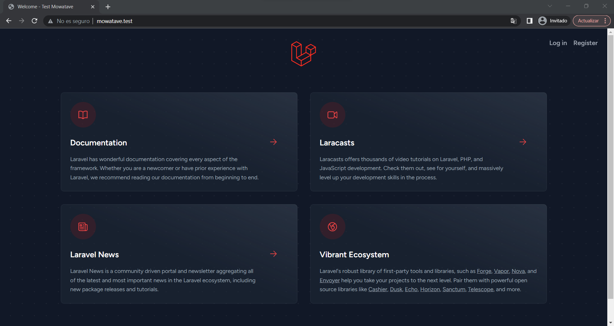
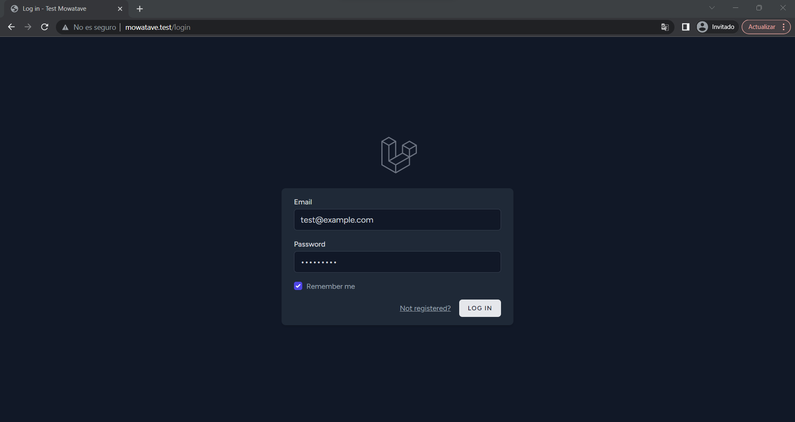
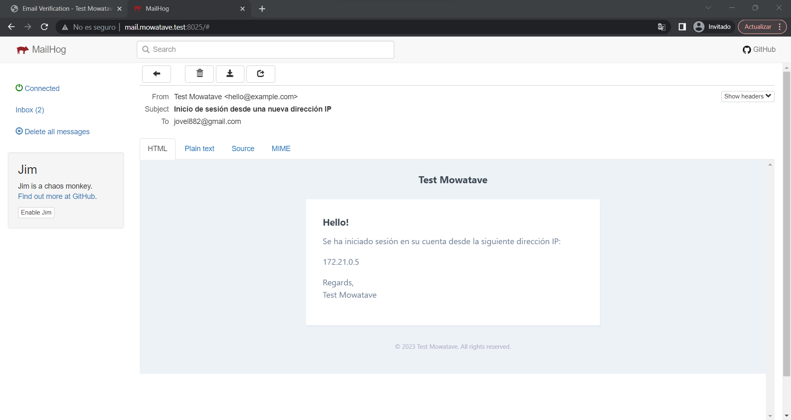
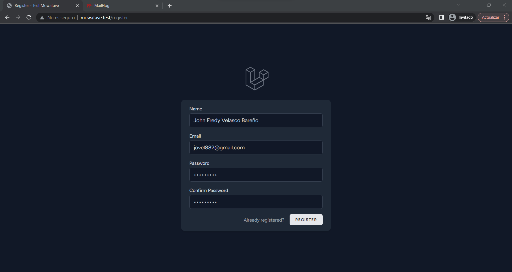
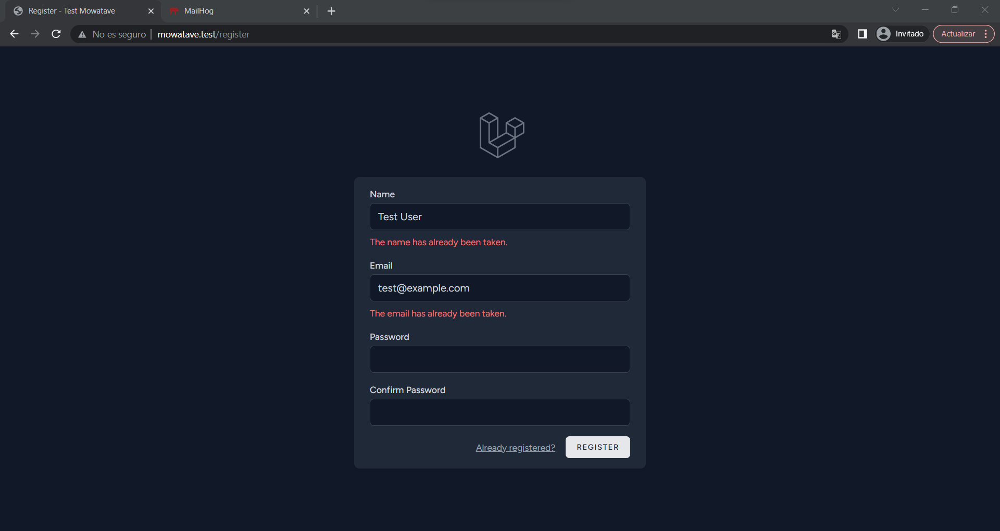
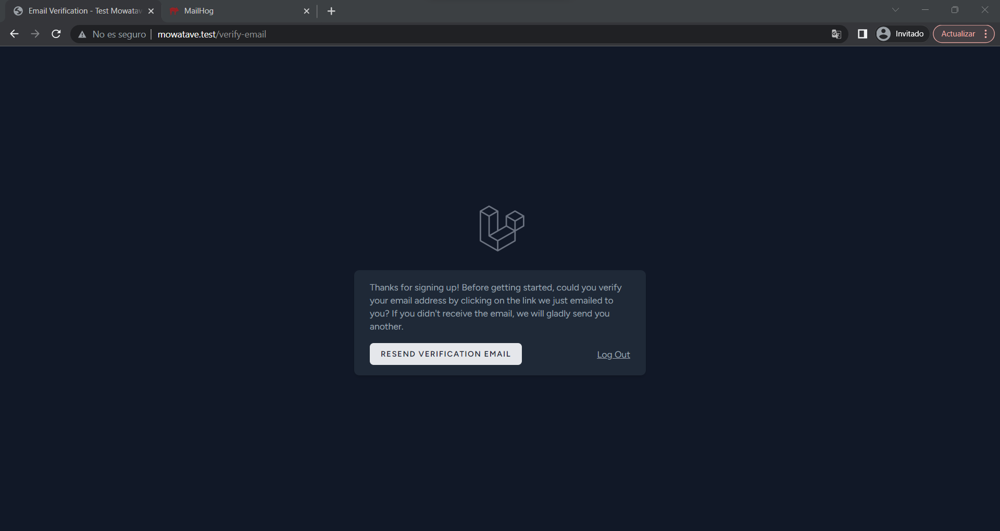
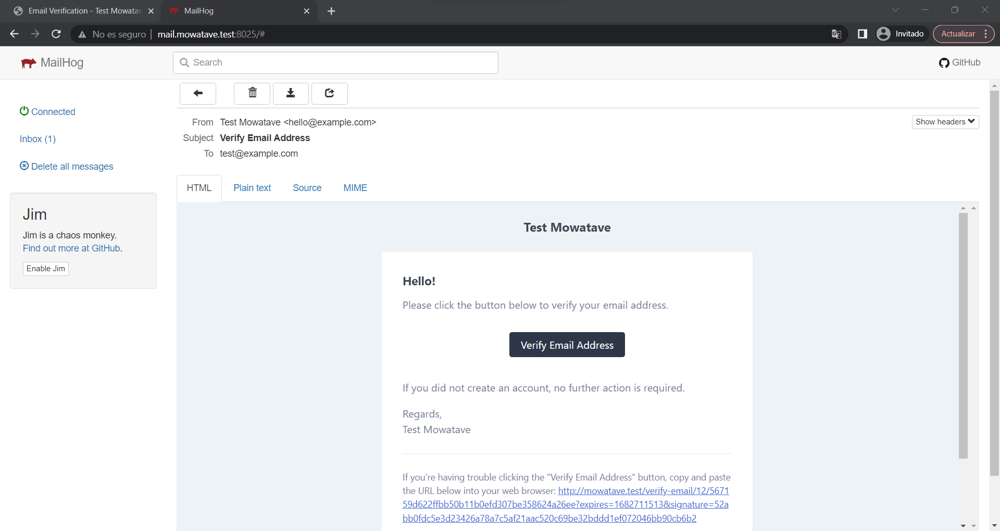
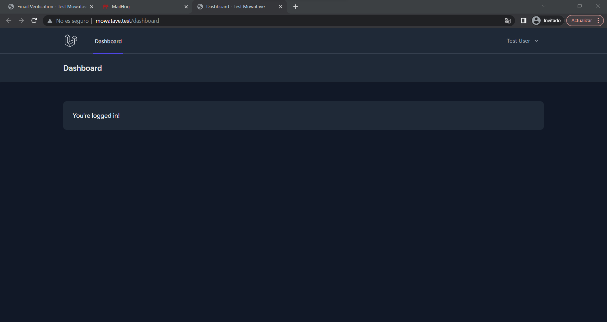
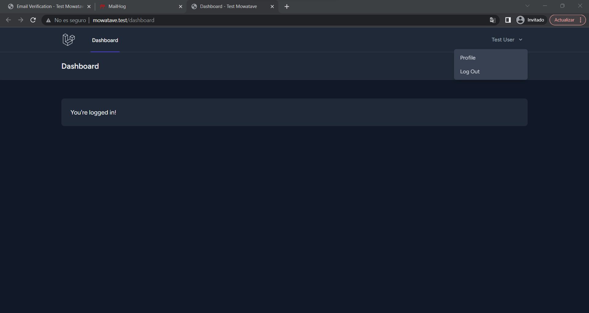
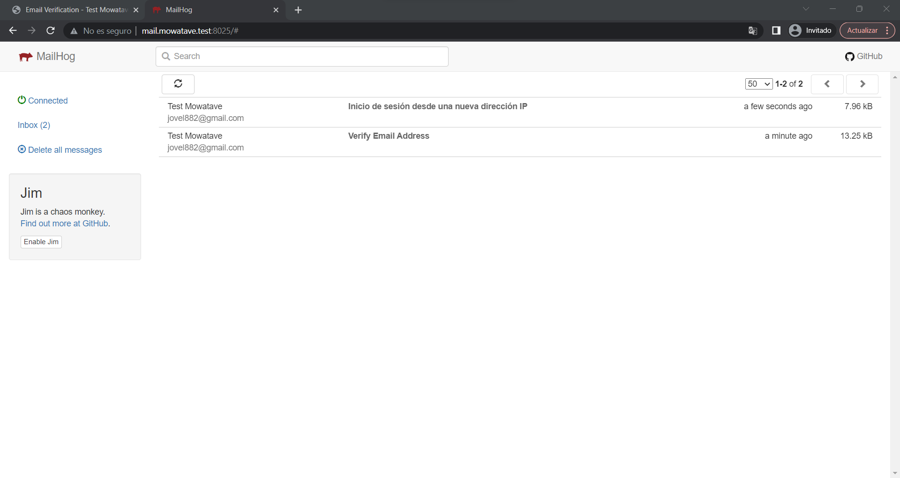

<br/>
<br/>

# :mount_fuji: Reto Técnico Mowatave.

<br/>
<br/>

## :bookmark_tabs: Tabla de contenido.

<br/>
<br/>

1. [Autor.](#black_nib-autor)

<br/>
<br/>

2. [Detalle de la solución.](#triangular_ruler-detalle-de-la-solución)

<br/>
<br/>

3. [Desplegar.](#airplane-desplegar)

<br/>
<br/>

## :black_nib: Autor.

<br/>
<br/>

**John Fredy Velasco Bareño** [jovel882@gmail.com](mailto:jovel882@gmail.com)

## :triangular_ruler: Detalle de la solución.

<br/>
<br/>

- Esta desarrollado con:
    <br/>
    <br/>
    - PHP 8.1
        <br/>
        <br/>
    - Laravel 10.8
        <br/>
        <br/>

<br/>
<br/>

Se desarrollo basado en los requerimientos descritos en este [enlace](https://docs.google.com/document/d/1hAD06UmQwnrGW3uS4eA9tP4fG_hW4plMriQUvQVEKnI) y se consiguió lo siguiente:

<br/>
<br/>

+ Se uso el [Starter Kit](https://laravel.com/docs/master/starter-kits) basado en vue.

<br/>
<br/>

+ Se precargo la BD a través del seeder general con 10 usuarios usando el factory de User con datos provistos por faker, además de un usuario `test@example.com` y contraseña `123456789`, todos estos usuarios se pueden usar para acceder y/o probar las condiciones requeridas.

<br/>
<br/>

+ Se hicieron los siguientes desarrollos.

    <br/>
    <br/>

    

    <br/>
    <br/>

    > Se tienen en el menú superior las dos opciones para ingresar o registrarse.

    <br/>
    <br/>

    + Para el login.

        <br/>
        <br/>

        

        <br/>
        <br/>

        > Esta es la interfaz de Login.

        <br/>
        <br/>

        + El botón de **LOG IN** se inhabilita mientras se valida el ingreso.

        <br/>
        <br/>

        + Se notifica por correo cuando se ingresa desde una nueva IP.

            <br/>
            <br/>

            

            <br/>
            <br/>

            > Este es el correo que llega con la notificación al Usuario.

            <br/>
            <br/>

            + Se creo un campo en el modelo de **User** con una [migracion](database/migrations/2023_04_28_120028_add_column_ips_on_users_table.php) para almacenar las IP en un arreglo.

            <br/>
            <br/>

            + Se creo un Accessor y un Mutator en el Modelo de [User](app/Models/User.php) para gestionar el arreglo de las IP.

            <br/>
            <br/>

            + Se creo un [Listeners](app/Listeners/NotifyNewIpAddress.php) y se suscribió al evento de Autenticación, en este se valida si la IP actual es nueva y envía la notificación por correo.

            <br/>
            <br/>

            + Se creo una [Notifications](app/Notifications/NewIpAddressNotification.php) para notificar por Correo al usuario.

            <br/>
            <br/>
            
        + Se hace uso del token almacenado en BD en el modelo de **User** en el campo de **remember_token** para mantener la sesión activa hasta que el usuario la cierre manualmente.

        <br/>
        <br/>
        
        + Se agrego el link **Not registered?** que redirige al formulario se registró en el [componente](resources/js/Pages/Auth/Login.vue) en Vue.

        <br/>
        <br/>

    + Para el Registro.

        <br/>
        <br/>

        

        <br/>
        <br/>

        > Esta es la interfaz de registro.

        <br/>
        <br/>

        + Se agrego la regla de validación en el [controller de autenticacion](app/Http/Controllers/Auth/RegisteredUserController.php) para validar que el nombre no se pueda repetir.

            <br/>
            <br/>

            

            <br/>
            <br/>

            > Errores de datos duplicados.

        <br/>
        <br/>

        + Las contraseñas se guardan de manera segura encriptadas en BD en el campo de **password**.

        <br/>
        <br/>

        + Se ajusto el modelo [User](app/Models/User.php) para que implemente la interfaz **MustVerifyEmail** y así se requiera la validación de la cuenta por correo.

            <br/>
            <br/>

            

            <br/>
            <br/>

            > Esta es la interfaz de notificación de envío de correo para la confirmación de la cuenta.

            <br/>
            <br/>

            

            <br/>
            <br/>

            > Correo para la confirmación de la cuenta.

            <br/>
            <br/>

        + Luego de confirmada la cuenta el usuario queda con la sesión iniciada automáticamente.

            <br/>
            <br/>

            

            <br/>
            <br/>

            > Interfaz luego de estar autenticado.

            <br/>
            <br/>

    + La interfaz incluye una opción para cerrar la sesión.

        <br/>
        <br/>

        

        <br/>
        <br/>
        
<br/>
<br/>

## :airplane: Desplegar.

<br/>
<br/>

El proyecto cuenta con una opción de despliegue conterizada con Docker, para usarla siga los siguientes pasos.

<br/>
<br/>

> :loudspeaker: El ambiente despliega un servidor [MailHog](https://github.com/mailhog/MailHog) para poder probar los correos.

<br/>
<br/>



<br/>
<br/>

+ Prerrequisitos

    <br/>
    <br/>

    + **Docker >= 20.\***

    <br/>
    <br/>

    + **Docker Compose >=2.\***

    <br/>
    <br/>

    + **Git >=2.\***

    <br/>
    <br/>

+ Pasos

    <br/>
    <br/>

    > :bulb: Si esta sobre algún sistema basado en Linux y ejecuta la siguiente línea se iniciará un ambiente totalmente funcional sobre el DNS [mowatave.test](http://mowatave.test/).

    <br/>
    <br/>

    ```sh

    git clone https://github.com/jovel882/mowatave.git && cd mowatave && cp Docker/.env.example Docker/.env && docker compose -f Docker/docker-compose.yml up -d && docker logs -f mowatave

    ```

    <br/>
    <br/>

    <br/>
    <br/>   

    + Clone el repositorio

        <br/>
        <br/>

        ```sh

        git clone https://github.com/jovel882/mowatave.git

        ```

        <br/>
        <br/>

    + Ingrese al folder del proyecto.

        <br/>
        <br/>

        ```sh

        cd mowatave

        ```

        <br/>
        <br/>
            
    + Cree los archivos de entorno basados en los de ejemplo.

        <br/>
        <br/>

        + Genere el ***.env*** dentro del folder de **Docker**, estas son las variables disponibles.

            <br/>
            <br/>

            ```sh

            cp Docker/.env.example Docker/.env

            ```

            <br/>
            <br/>
            
            + `COMPOSE_PROJECT_NAME` (\*Requerido): Define el nombre del proyecto que se genera con Docker Compose, en el de ejemplo se deja **mowatave**.

            <br/>
            <br/>
            
            + `MYSQL_DATABASE` (\*Requerido): Define el nombre de la BD que se creara.

            <br/>
            <br/>
            
            + `MYSQL_ROOT_PASSWORD` (\*Requerido): Define contraseña del usuario root del motor de BD **NOTA: No dejar vacío**.

            <br/>
            <br/>

    + Variables dentro del archivo **"docker-compose.yml"**.

        <br/>
        <br/>

        + Dentro del servicio de nombre **"mh_mowatave"** en la sección de **"environment"**

            <br/>
            <br/>

            + `VIRTUAL_HOST` (\*Requerido): Define el nombre del DNS sobre el que se levantara el servidor de [MailHog](https://github.com/mailhog/MailHog), por defecto esta **mail.mowatave.test**.
                
            <br/>
            <br/>

        + Dentro del servicio de nombre **"mowatave"** en la sección de **"environment"**

            <br/>
            <br/>

            + `VIRTUAL_HOST` (\*Requerido): Define el nombre del DNS sobre el que se levantara el ambiente, por defecto esta **mowatave.test**.
                
            <br/>
            <br/>

    + Ejecute el docker-compose.yml para levantar el ambiente.
    
        <br/>
        <br/>

        ```sh

        docker compose -f Docker/docker-compose.yml up -d

        ```

        <br/>
        <br/>

    + Siga el estado del despliegue del contenedor principal con el siguiente comando.

        <br/>
        <br/>

        ```sh

        docker logs -f mowatave

        ```
        <br/>
        <br/>

        > :pushpin: En este log si todo esta correcto podrá ver la instalación de paquetes con Composer, instalación de paquetes con NPM, compilado de archivos con NPM, ejecución de migraciones, ejecución de seeder y finalmente el inicio de los servicios del servidor web con Supervisor entre otros.

        <br/>
        <br/>

    + Agregue los registros de host para redirigir las peticiones a los **DNS** que se definieron en **VIRTUAL_HOST** del archivo **"docker-compose.yml"**. En este [enlace](https://www.siteground.es/kb/archivo-hosts/) hay una forma de hacerlo dependiendo su OS.

        <br/>
        <br/>
        
        **Ejemplo:**    

        <br/>
        <br/>

        ```sh

        127.0.0.1 mowatave.test
        127.0.0.1 mail.mowatave.test

        ```
    <br/>
    <br/>

    + Acceda al resultado de la solución **http://{DNS}** donde **DNS** se debe cambiar por el que se definió en **VIRTUAL_HOST** del archivo **"docker-compose.yml"**. Ej. [http://mowatave.test](http://mowatave.test)

    <br/>
    <br/>

    + Acceda al servidor MailHog **http://{DNS}:8025/** donde **DNS** se debe cambiar por el que se definió en **VIRTUAL_HOST** del archivo **"docker-compose.yml"**. Ej. [http://mail.mowatave.test:8025/](http://mail.mowatave.test:8025)

    <br/>
    <br/>
